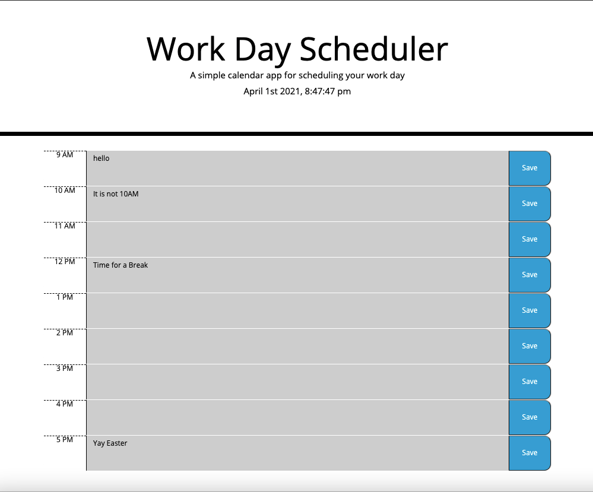

# HW-WEEK-5

This is a work day Scheduler that gives date and time at the top with an option to save schedules per hour in each hour block. 

Once saved, the contents remain in the blocks even after refreshing the page. 

  

